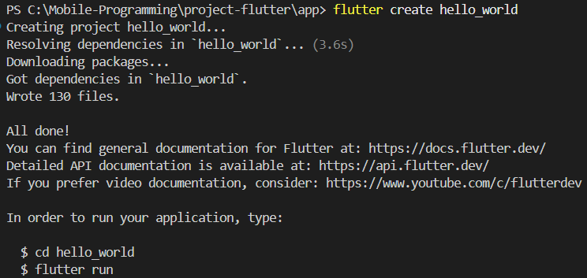

# Project Flutter - Mobile Programming

Repository ini berisi project-project Flutter untuk mata kuliah Mobile Programming.

## Struktur Folder

```
project-flutter/
├── app/                    # Berisi aplikasi Flutter
│   └── hello_world/       # Praktikum 1: Project Flutter pertama
├── screenshots/           # Screenshot aplikasi
├── laporan-proyek.md     # Laporan project akhir
└── README.md            # Dokumentasi project (file ini)
```

## Praktikum 1: Membuat Project Flutter Baru

### Tujuan
Membuat project Flutter baru dengan nama `hello_world` dan memahami struktur dasar project Flutter.

### Langkah-langkah

#### Langkah 1: Membuka Command Palette
- Buka VS Code
- Tekan `Ctrl + Shift + P` untuk membuka Command Palette
- Ketik "Flutter" dan pilih "New Application Project"

#### Langkah 2: Memilih Lokasi Project
- Pilih folder `project-flutter/app` sebagai lokasi project
- Klik "Select a folder to create the project in"

#### Langkah 3: Membuat Nama Project
- Buat nama project: `hello_world`
- Pastikan menggunakan huruf kecil semua (lowercase)
- Gunakan underscore (_) untuk memisahkan kata
- Tekan Enter dan tunggu proses selesai

#### Langkah 4: Verifikasi Project
- Pastikan project berhasil dibuat dengan pesan "Your Flutter Project is ready!"
- Struktur project Flutter standar sudah terbentuk

### Hasil

Project Flutter `hello_world` berhasil dibuat dengan struktur sebagai berikut:

```
hello_world/
├── android/              # Konfigurasi Android
├── ios/                 # Konfigurasi iOS
├── lib/                 # Kode Dart utama
│   └── main.dart       # Entry point aplikasi
├── test/               # File testing
├── web/                # Konfigurasi Web
├── pubspec.yaml        # Dependencies dan metadata
└── README.md          # Dokumentasi project
```

### Cara Menjalankan

1. Buka terminal di folder `project-flutter/app/hello_world`

### Screenshot

Screenshots aplikasi akan disimpan di folder `screenshots/` dengan penamaan:
- 

### Catatan

- Nama project harus lowercase tanpa spasi
- Tidak boleh diawali dengan angka atau karakter khusus
- Nama project berbeda dengan nama aplikasi yang akan tampil di store
- Untuk deployment, nama aplikasi dapat diatur kemudian

---
