# Laporan Jobsheet 5 - Basic Widget Flutter

**Nama**: Indira Nafa Aurah Huda  
**NIM**: 2341720001
**Kelas**: TI 3E

## Praktikum 4: Menerapkan Widget Dasar

### Langkah 1: Text Widget

#### Tujuan
Membuat widget text sederhana untuk menampilkan teks dengan styling tertentu.

#### Penjelasan Kode

- **StatelessWidget**: Widget yang tidak memiliki state yang berubah-ubah
- **TextStyle**: Untuk mengatur styling text seperti warna dan ukuran font
- **TextAlign.center**: Untuk mengatur alignment text ke tengah
- **Colors.red**: Menggunakan warna merah dari material design

#### Screenshot

### Langkah 2: Image Widget

#### Tujuan
Membuat widget untuk menampilkan gambar dari assets project.

#### Penjelasan Kode

- **AssetImage**: Untuk memuat gambar dari folder assets
- **pubspec.yaml**: File konfigurasi untuk mendefinisikan assets yang digunakan
- **assets/**: Konvensi penamaan folder untuk menyimpan file assets
- **Image widget**: Widget bawaan Flutter untuk menampilkan gambar

#### Screenshot
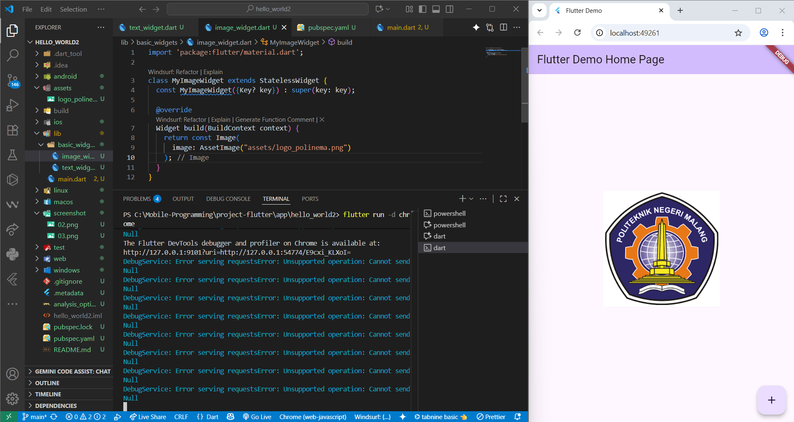

## Praktikum 5: Menerapkan Widget Material Design dan iOS Cupertino

### Langkah 1: Cupertino Button dan Loading Bar

#### Tujuan
Membuat widget menggunakan Cupertino design (iOS style) yang terdiri dari button dan loading indicator.

#### Langkah-langkah Implementasi

1. **Membuat file `loading_cupertino.dart`**
   - Buat file baru di folder `lib/basic_widgets/`
   - Import material dan cupertino packages

#### Penjelasan Kode

- **CupertinoButton**: Button dengan style iOS/Cupertino design
- **CupertinoActivityIndicator**: Loading indicator dengan style iOS
- **Container**: Wrapper dengan styling (margin, color)
- **Column**: Layout widget untuk menyusun children secara vertikal
- **EdgeInsets.only(top: 30)**: Memberikan margin atas 30 pixel

#### Screenshot
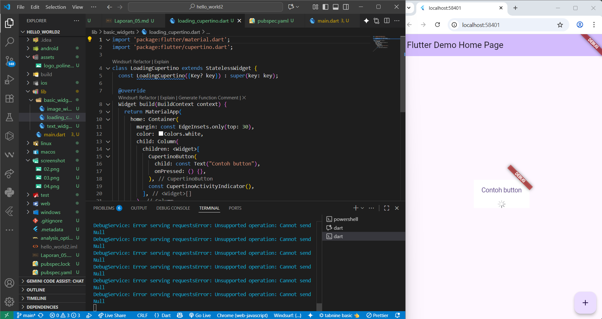

### Langkah 2: Floating Action Button (FAB)

#### Tujuan
Membuat Floating Action Button dengan styling custom menggunakan material design.

#### Penjelasan Kode

- **FloatingActionButton**: Button melayang dengan shape circular
- **Icons.thumb_up**: Icon jempol dari material design icons
- **backgroundColor: Colors.pink**: Mengatur warna background menjadi pink
- **onPressed**: Callback function yang dipanggil saat button ditekan

#### Screenshot
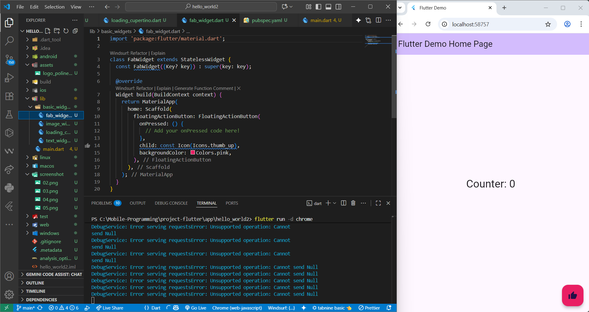

### Langkah 3: Scaffold Widget

#### Tujuan
Menggunakan Scaffold widget untuk mengatur tata letak sesuai dengan material design.

#### Penjelasan Kode

- **Scaffold**: Struktur dasar layout material design
- **AppBar**: Header bar di bagian atas
- **BottomAppBar**: Navigation bar di bagian bawah
- **FloatingActionButtonLocation.centerDocked**: Posisi FAB di tengah bawah
- **StatefulWidget**: Widget yang memiliki state yang dapat berubah
- **setState()**: Method untuk memperbarui state dan UI

#### Screenshot
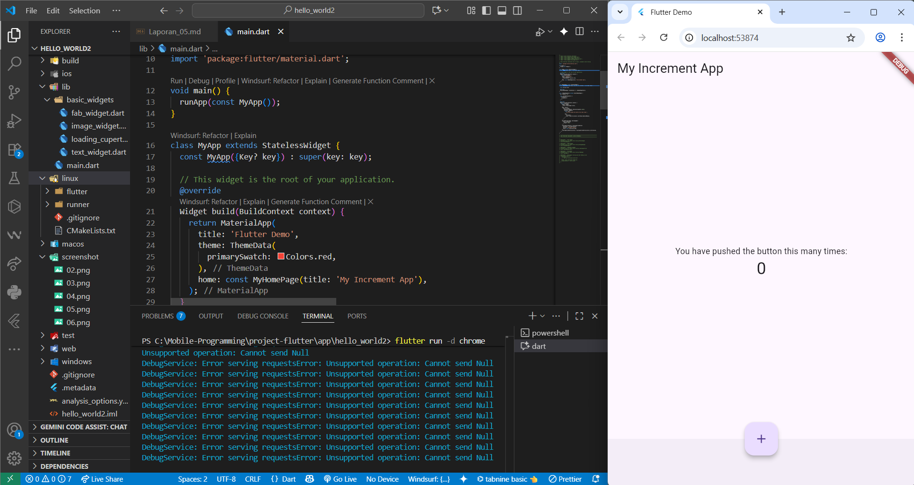

### Langkah 4: Dialog Widget

#### Tujuan
Mengimplementasikan AlertDialog untuk menampilkan popup dialog.

#### Penjelasan Kode

- **AlertDialog**: Widget untuk menampilkan dialog box
- **showDialog()**: Method untuk menampilkan dialog
- **Navigator.pop()**: Method untuk menutup dialog
- **TextButton**: Button dengan style text
- **ElevatedButton**: Button dengan efek elevation/shadow

#### Screenshot
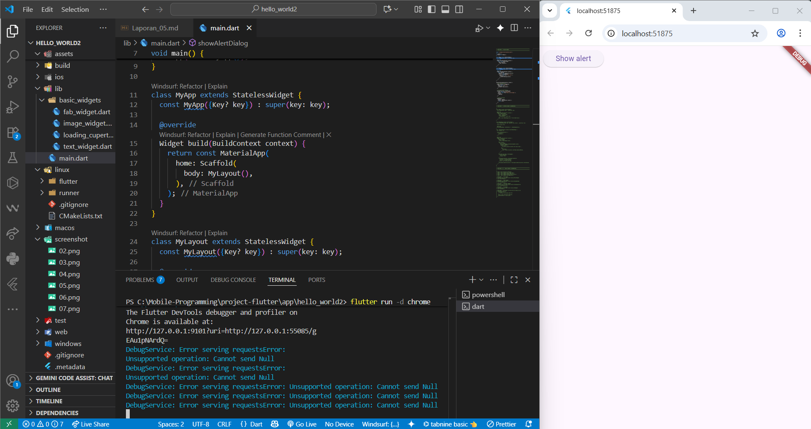

### Langkah 5: Input dan Selection Widget

#### Tujuan
Mengimplementasikan TextField untuk menerima input dari user.

#### Penjelasan Kode

- **TextField**: Widget untuk input text dari user
- **InputDecoration**: Dekorasi untuk styling TextField
- **OutlineInputBorder**: Border dengan outline style
- **labelText**: Text label yang muncul di dalam TextField
- **obscureText: false**: Menentukan apakah text disembunyikan (untuk password)

#### Screenshot
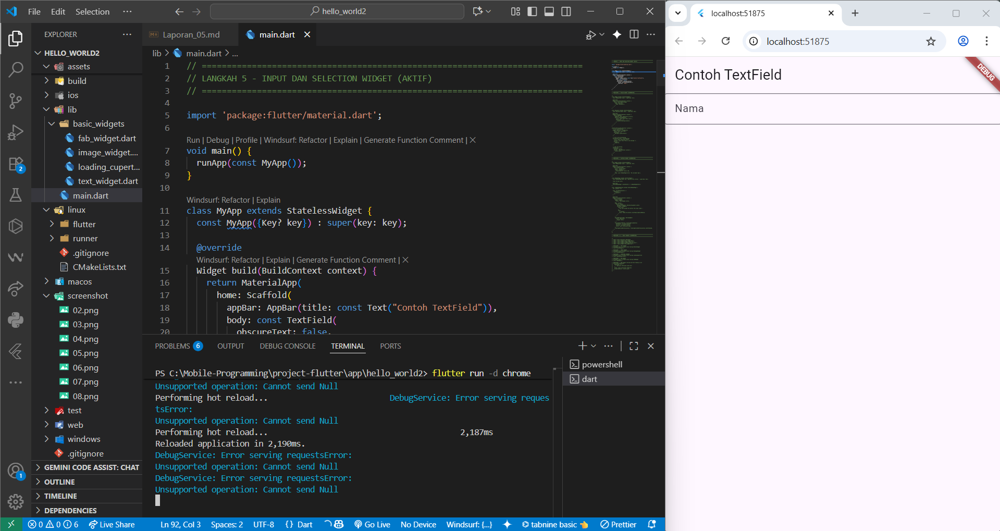

### Langkah 6: Date and Time Pickers

#### Tujuan
Mengimplementasikan Date Picker untuk memilih tanggal.

#### Penjelasan Kode

- **showDatePicker()**: Method untuk menampilkan date picker dialog
- **DateTime**: Class untuk merepresentasikan tanggal dan waktu
- **Future<void>**: Return type untuk async function
- **async/await**: Pattern untuk handling asynchronous operation
- **setState()**: Method untuk memperbarui state setelah tanggal dipilih
- **SizedBox**: Widget untuk memberikan spacing

#### Screenshot
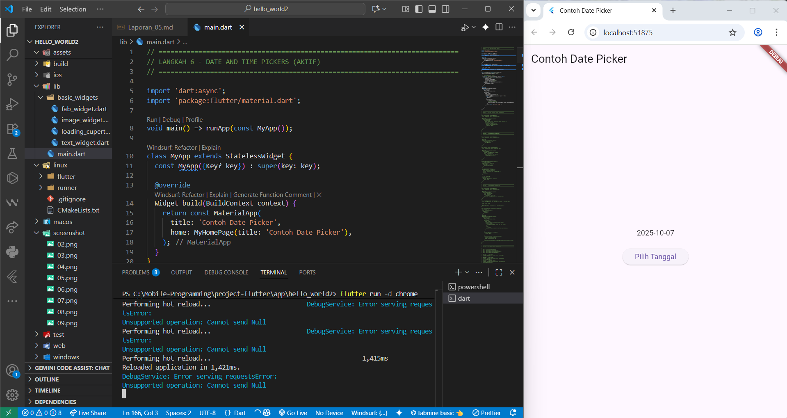

## TUGAS PRAKTIKUM: Flutter Application Development (Namer App)

### Tujuan
Membuat aplikasi Flutter pertama yang lengkap dengan mengikuti tutorial resmi dari Google Codelabs. Aplikasi ini merupakan word pair generator dengan fitur favorit dan navigasi.

### Deskripsi Proyek
**Namer App** adalah aplikasi Flutter yang dapat:
- Generate pasangan kata bahasa Inggris secara acak
- Menambah dan menghapus kata favorit
- Navigasi antara halaman Home dan Favorites
- Responsive design yang menyesuaikan ukuran layar
- Modern Material Design 3

### Langkah 1: Setup Project dan Dependencies

**Penjelasan Dependencies:**
- **english_words**: Package untuk generate kata bahasa Inggris
- **provider**: State management solution untuk Flutter

#### Screenshot
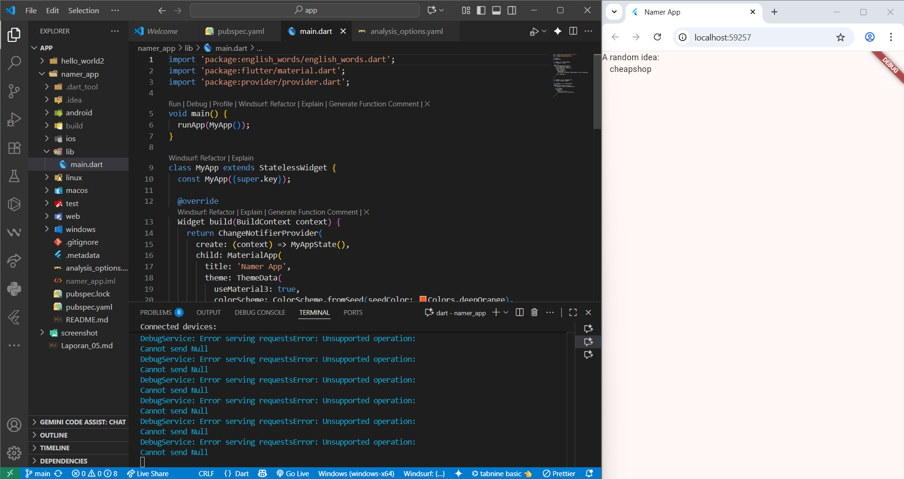
*Konfigurasi pubspec.yaml dengan dependencies yang diperlukan*

### Langkah 2: Aplikasi Dasar dengan Hot Reload

**Penjelasan Kode:**
- **ChangeNotifierProvider**: Menyediakan state ke seluruh widget tree
- **ChangeNotifier**: Base class untuk state management
- **context.watch**: Mendengarkan perubahan state
- **WordPair.random()**: Generate pasangan kata acak

#### Screenshot
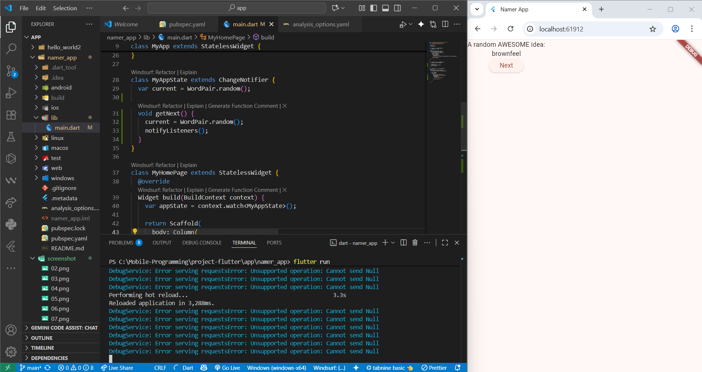
*Aplikasi dasar dengan text generator dan hot reload*

### Langkah 3: Menambahkan Tombol dan Logika

**Penjelasan:**
- **notifyListeners()**: Memberitahu widget untuk rebuild
- **List\<WordPair>**: Type-safe list untuk menyimpan favorit
- **toggleFavorite()**: Logic untuk add/remove favorites

#### Screenshot
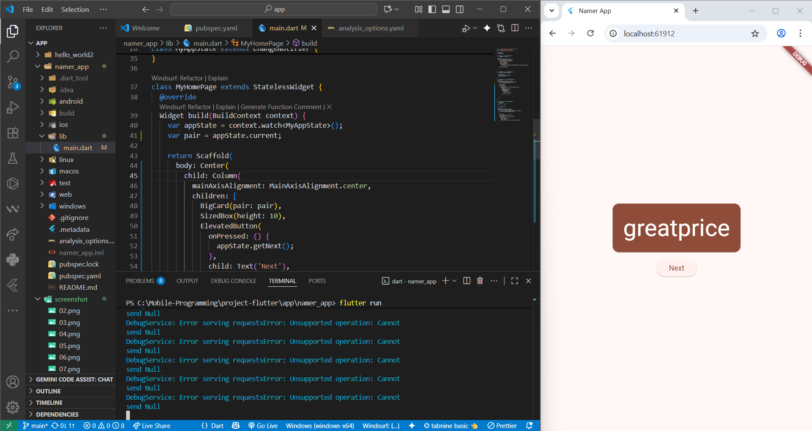
*Implementasi tombol Next dan logika state management*

### Langkah 4: Memperindah UI dengan BigCard Widget

**Features:**
- **Theme integration**: Menggunakan color scheme aplikasi
- **Accessibility**: semanticsLabel untuk screen reader
- **Typography**: displayMedium text style
- **Material Design**: Card widget dengan proper spacing

#### Screenshot
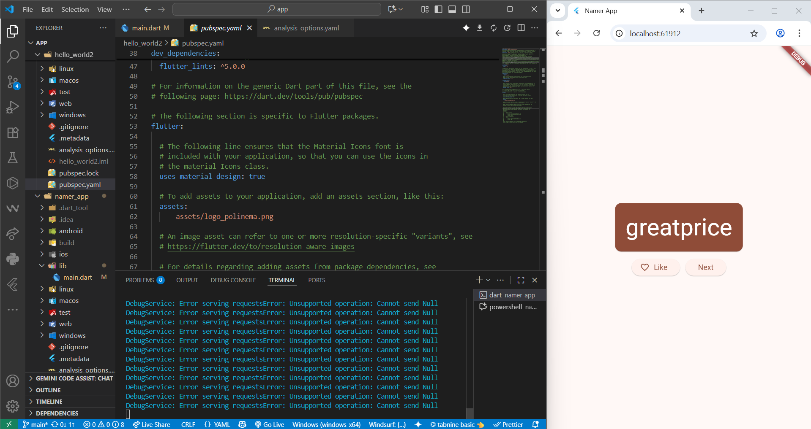
*BigCard widget dengan styling dan tema yang konsisten*

### Langkah 5: Navigasi dengan NavigationRail

**Responsive Features:**
- **LayoutBuilder**: Responsive design berdasarkan constraint
- **NavigationRail**: Modern navigation component
- **SafeArea**: Protection dari notch dan status bar
- **extended property**: Auto show/hide labels berdasarkan lebar layar

#### Screenshot
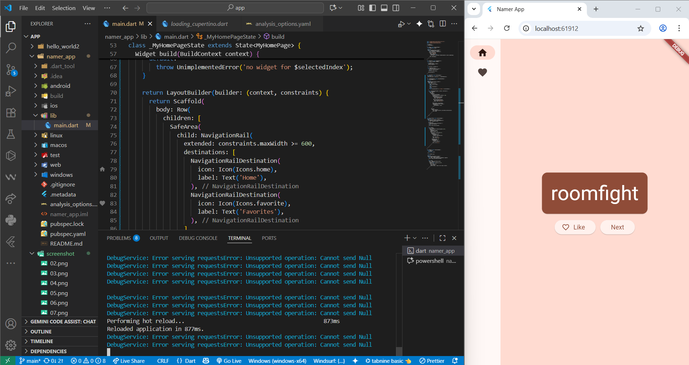
*NavigationRail dengan responsive design dan multiple pages*
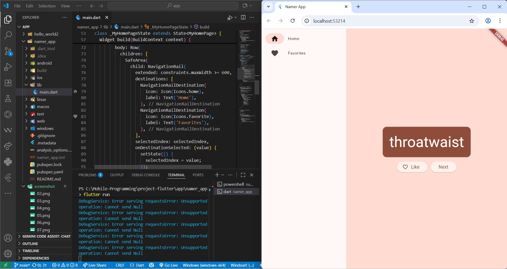

### Langkah 6: Generator Page dengan Interactive Buttons

**Interactive Elements:**
- **Dynamic icons**: Berubah berdasarkan favorite status
- **ElevatedButton.icon**: Button dengan icon dan text
- **Row layout**: Horizontal arrangement untuk buttons
- **State synchronization**: UI selalu sync dengan state

#### Screenshot
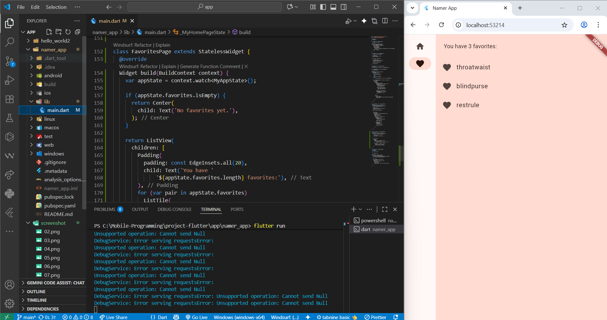
*Generator Page lengkap dengan interactive buttons dan dynamic icons*

### Fitur-Fitur Aplikasi

#### 1. State Management
- **Provider pattern** untuk global state
- **ChangeNotifier** untuk reactive updates
- **Type-safe** state dengan generics

#### 2. Responsive Design
- **LayoutBuilder** untuk adaptive layout
- **NavigationRail** yang responsive
- **Breakpoint** di 600px untuk extended mode

#### 3. Material Design 3
- **ColorScheme** dengan seed color
- **Typography** system dengan proper hierarchy
- **Component** styling yang konsisten

#### 4. Accessibility
- **semanticsLabel** untuk screen readers
- **SafeArea** untuk different device types
- **High contrast** color combinations

#### 5. Navigation
- **Multi-page** navigation dengan StatefulWidget
- **NavigationRail** untuk desktop/tablet
- **State preservation** antar navigation