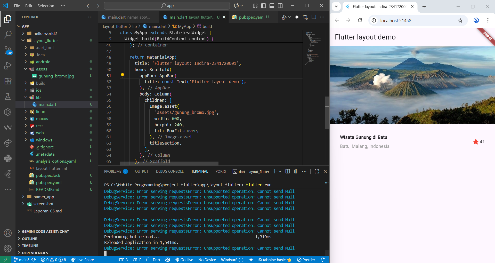
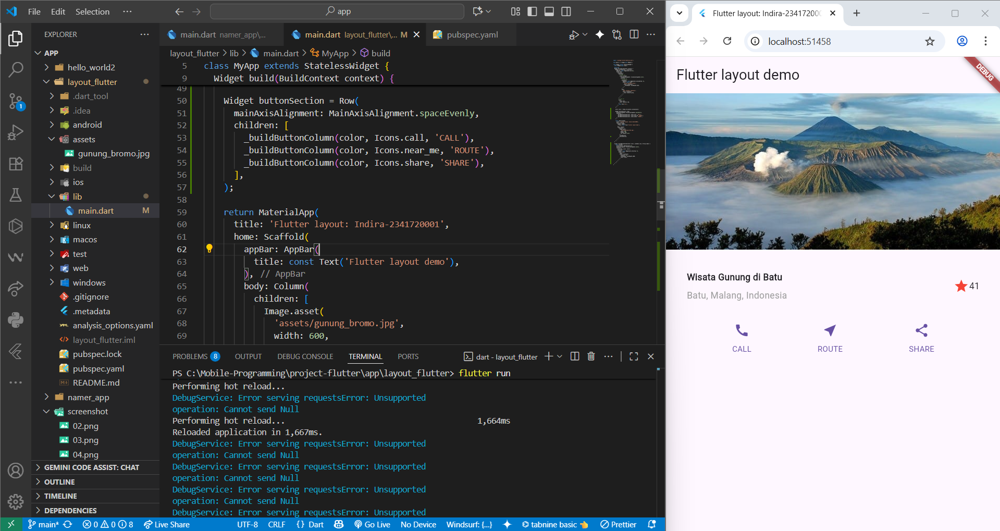
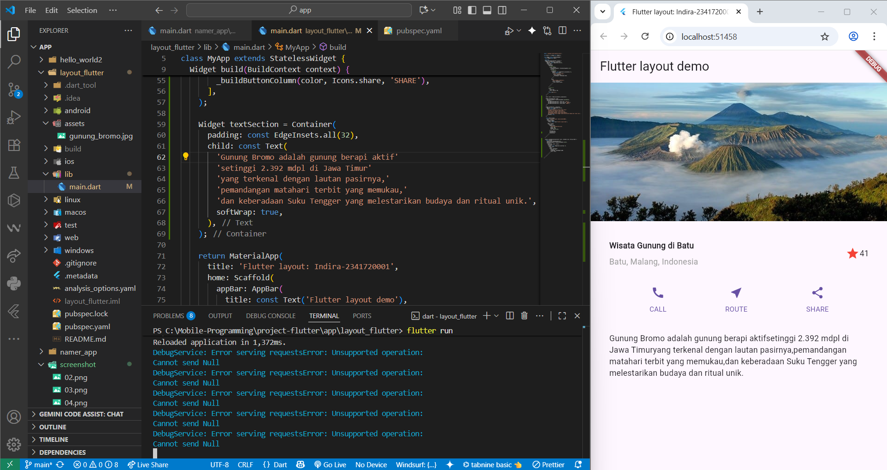
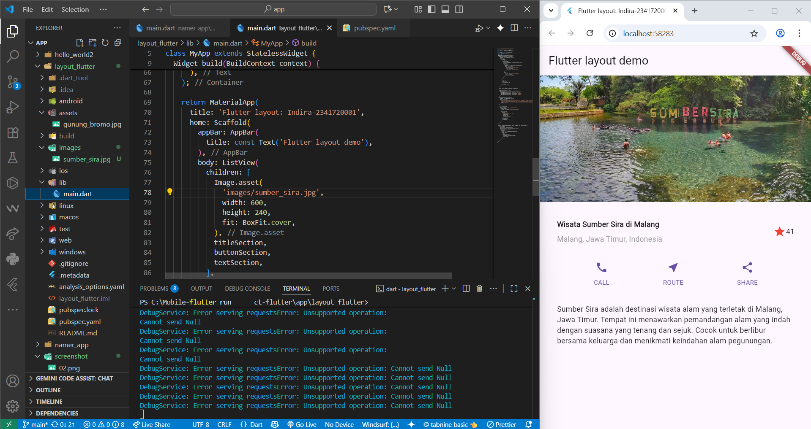
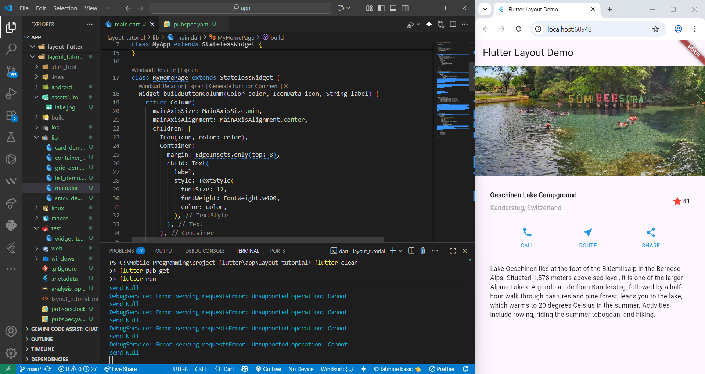
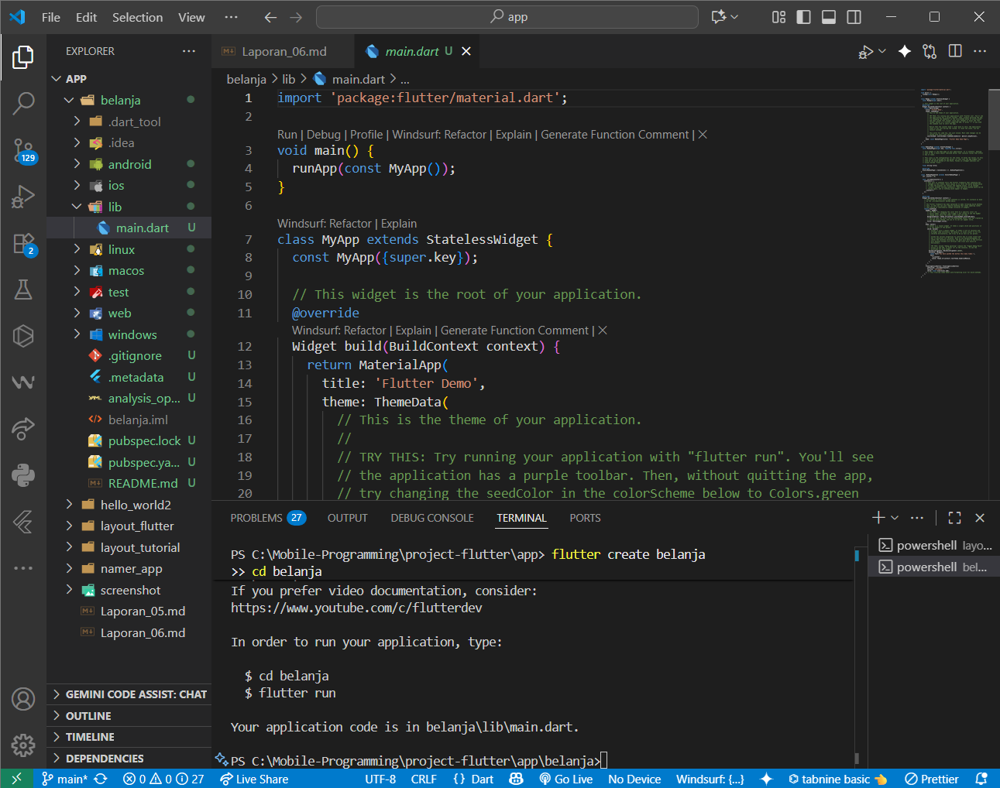
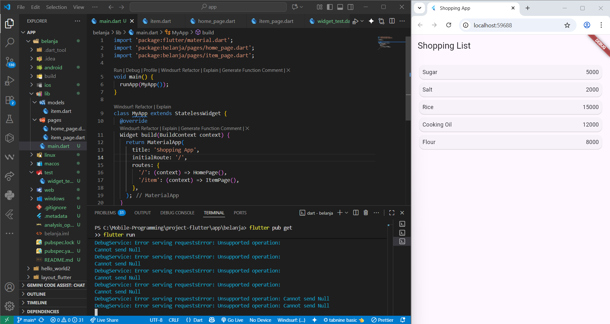

# Laporan Jobsheet 6 - Layout dan Navigasi

**Nama:** Indira Nafa Aurah Huda  
**NIM:** 2341720001  
**Kelas:** TI-3E  
**Mata Kuliah:** Mobile Programming

---

## Praktikum 1: Membangun Layout di Flutter

Pada praktikum ini, saya membuat aplikasi Flutter dengan layout dasar yang menampilkan "Hello World". Praktikum dimulai dengan membuat project baru bernama `layout_flutter`, kemudian mengimplementasikan title section yang berisi informasi wisata Sumber Sira di Malang. Title section terdiri dari kolom teks (nama lokasi dan alamat) yang menggunakan widget `Expanded`, ikon bintang berwarna merah, dan rating angka. Layout menggunakan `Container` dengan padding dan `Row` untuk penataan horizontal.

---

## Praktikum 2: Implementasi Button Row

Praktikum ini mengimplementasikan baris tombol interaktif dengan tiga aksi utama: CALL, ROUTE, dan SHARE. Saya membuat method helper `_buildButtonColumn()` yang menerima parameter warna, ikon, dan label untuk membuat kolom button yang konsisten. Button section menggunakan widget `Row` dengan `MainAxisAlignment.spaceEvenly` untuk mendistribusikan tombol secara merata. Setiap tombol terdiri dari ikon dan teks label dengan styling yang seragam menggunakan tema aplikasi.

---

## Praktikum 3: Implementasi Text Section

Pada praktikum ini, saya menambahkan section deskripsi teks yang berisi informasi detail tentang wisata Sumber Sira. Text section menggunakan widget `Container` dengan padding 32 piksel dan properti `softWrap: true` untuk memastikan teks dapat terbungkus dengan baik. Deskripsi menceritakan tentang keindahan alam Sumber Sira sebagai destinasi wisata keluarga di Malang, Jawa Timur dengan suasana yang tenang dan sejuk.

---

## Praktikum 4: Implementasi Image Section

Praktikum terakhir mengimplementasikan gambar sebagai header utama layout. Saya menambahkan asset gambar `sumber_sira.jpg` ke folder assets dan mengkonfigurasi `pubspec.yaml`. Gambar ditampilkan menggunakan `Image.asset()` dengan `BoxFit.cover` yang memastikan gambar menutupi area render secara proporsional. Layout akhir menggunakan `ListView` sebagai pengganti `Column` untuk mendukung scrolling ketika konten melebihi tinggi layar. Hasil final menampilkan layout lengkap dengan gambar, title section, button section, dan text section yang tersusun vertikal.

---

## Tugas Praktikum 1: Flutter Layout Tutorial

Tugas praktikum ini mengimplementasikan berbagai jenis layout widget Flutter berdasarkan dokumentasi resmi Flutter Layout. Dibuat aplikasi tutorial yang mendemonstrasikan penggunaan Container, GridView, ListView, Stack, dan Card widgets.

### Fitur yang Diimplementasikan:

**1. Basic Layout Demo**
- Layout utama dengan gambar, title, buttons, dan text
- Implementasi dari praktikum 1-4 yang sudah dikerjakan

**2. Container Demo** 
- Menunjukkan penggunaan Container dengan decoration
- Border radius, margin, padding, dan background color
- Nested containers untuk efek visual

**3. GridView Demo**
- Grid layout dengan 2 kolom
- 20 item dengan icon dan text
- Card wrapper untuk setiap grid item

**4. ListView Demo**
- List dengan ListTile widgets
- Leading icons, title, subtitle, dan trailing icons
- Navigasi antar halaman menggunakan Navigator

**5. Stack Demo**
- Overlay widgets menggunakan Stack
- Gradient background dengan Positioned widgets
- Text overlay di atas background

**6. Card Demo**
- Card widget dengan ListTile content
- Action buttons di bagian bawah
- SnackBar feedback saat button ditekan

### Navigation System
Aplikasi menggunakan Navigator.push() untuk berpindah antar halaman demo. Setiap demo memiliki AppBar dengan back button otomatis untuk kembali ke menu utama.

## Praktikum 5: Membangun Navigasi di Flutter

Praktikum ini membangun aplikasi daftar belanja multi-halaman yang mendemonstrasikan navigasi dan route management di Flutter. Aplikasi terdiri dari HomePage yang menampilkan daftar item belanja menggunakan ListView.builder dan ItemPage yang menampilkan detail item yang dipilih. Data model Item dibuat dengan class yang memiliki properti name dan price. Navigation system menggunakan named routes dimana HomePage didefinisikan sebagai route '/' dan ItemPage sebagai route '/item' di main.dart. 

Setiap item dalam ListView dibungkus dengan InkWell widget untuk memberikan touch feedback dan navigasi ke halaman detail. Data item dikirim ke ItemPage menggunakan arguments pada Navigator.pushNamed() dan diterima melalui ModalRoute.of(context).settings.arguments. ListView menggunakan Card widget sebagai container untuk menampilkan nama dan harga item dalam Row layout. ItemPage menampilkan detail item dengan format yang rapi menggunakan Column dan Text widgets, serta memiliki AppBar dengan title dinamis sesuai nama item yang dipilih.

---

## Tugas Praktikum 2: Modifikasi dan Implementasi Go Router

Tugas ini mengembangkan aplikasi belanja dari Praktikum 5 dengan menambahkan atribut imageUrl, stock, dan rating pada model Item. Tampilan diubah dari ListView menjadi GridView 2 kolom dengan desain marketplace yang menampilkan gambar, nama, harga, rating bintang, dan stok. Hero widget diimplementasikan untuk animasi transisi smooth antara halaman utama dan detail, menciptakan kontinuitas visual yang menarik.

Sistem navigasi dimodernisasi menggunakan plugin go_router yang memberikan type-safe navigation, declarative routing, dan error handling yang lebih baik. Aplikasi direfactor dengan membuat app_router.dart untuk konfigurasi route dan mengupdate main.dart menggunakan MaterialApp.router. Navigation menggunakan context.go() dengan data passing melalui extra parameter yang lebih clean dibandingkan arguments tradisional.

---

## Kesimpulan

Pada praktikum Layout dan Navigasi ini, berhasil diimplementasikan aplikasi Flutter dengan layout yang kompleks dan menarik. Aplikasi menampilkan informasi wisata Sumber Sira dengan struktur yang terdiri dari gambar header, informasi lokasi dengan rating, tombol interaktif, dan deskripsi detail. Pengembangan lebih lanjut dengan implementasi aplikasi belanja menunjukkan kemampuan Flutter dalam membuat aplikasi multi-halaman dengan navigasi yang smooth, data management yang terstruktur, dan UI yang responsif menggunakan GridView dan Hero animations. Implementasi go_router memberikan fondasi yang kuat untuk pengembangan aplikasi yang scalable dengan routing system yang modern dan maintainable.