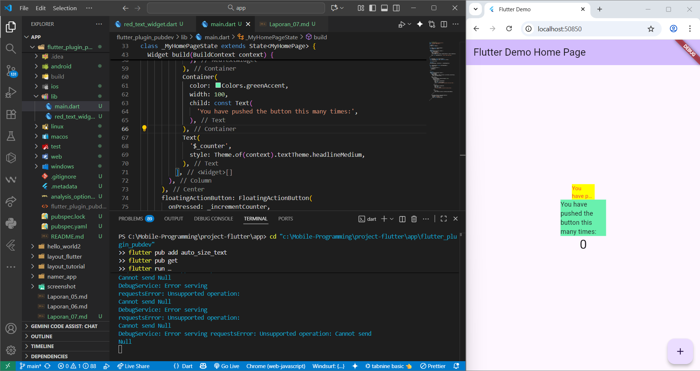

# Laporan Jobsheet 07 - 12

**Nama:** Indira Nafa Aurah Huda  
**NIM:** 2341720001  
**Kelas:** TI-3E  

## Tujuan
Mempelajari cara menambahkan plugin pihak ketiga ke proyek Flutter, membuat widget kustom, dan menggunakan widget tersebut di layar utama aplikasi.

---

## Langkah 1: Setup Project dan Struktur File

#### Tujuan
Menyiapkan project Flutter dan membuat file untuk widget kustom.

---

## Langkah 2: Membuat RedTextWidget (Versi Dasar)

#### Tujuan
Membuat StatelessWidget sederhana yang menampilkan teks berwarna merah.

#### Penjelasan Kode
- Gunakan StatelessWidget untuk widget tanpa state.
- Tambahkan properti teks agar widget dapat menerima string dari pemanggil.
- Styling teks menggunakan TextStyle (color: Colors.red, fontSize: 14).

---

## Langkah 3: Menjalankan dan Menguji Widget Dasar

#### Tujuan
Memastikan widget kustom bekerja saat dipanggil dari main.dart.

---

## Langkah 4: Menambahkan Widget AutoSizeText

#### Tujuan
Mengganti Text biasa dengan AutoSizeText dari plugin auto_size_text agar teks otomatis mengecil ketika ruang terbatas.

#### Perubahan
Pada file lib/red_text_widget.dart ubah return menjadi:

AutoSizeText(
  text,
  style: const TextStyle(color: Colors.red, fontSize: 14),
  maxLines: 2,
  overflow: TextOverflow.ellipsis,
);

#### Penjelasan Error yang Muncul
- Undefined class 'AutoSizeText' -> plugin auto_size_text belum ditambahkan di pubspec.yaml atau belum di-import.
- Undefined name 'text' -> widget belum memiliki properti text; pastikan RedTextWidget menerima text lewat konstruktor.

---

## Langkah 5: Menambahkan Dependency dan Import

#### Tujuan
Memastikan plugin tersedia dan dapat digunakan oleh kode.

#### Screenshot

## Pertanyaan Tugas Praktikum

#### Menjelaskan maksud dari langkah 2 pada praktikum tersebut!
Membuat widget kustom RedTextWidget sebagai StatelessWidget yang menerima teks lewat properti (final String text) dan menampilkan teks dengan styling merah (TextStyle).
Tujuan: memisahkan UI teks ke komponen reusable sehingga bisa dipanggil dari main.dart dengan parameter berbeda.

#### Menjelaskan maksud dari langkah 5 pada praktikum tersebut!
Menambahkan dependency plugin auto_size_text ke proyek (pubspec.yaml) dan meng-import paketnya di red_text_widget.dart.
Tujuan: membuat AutoSizeText tersedia di compile/runtime — tanpa langkah ini akan muncul error "Undefined class 'AutoSizeText'" atau "Target of URI doesn't exist".

#### Pada langkah 6 terdapat dua widget yang ditambahkan, jelaskan fungsi dan perbedaannya!
Container dengan RedTextWidget (AutoSizeText) — lebar terbatas (width: 50). AutoSizeText secara otomatis mengecilkan ukuran font supaya teks muat hingga batas minFontSize / maxLines yang ditentukan. cocok untuk teks responsif di ruang sempit.
Container dengan Text biasa (width: 100) — Text memakai ukuran font tetap dari TextStyle; jika ruang tidak cukup, teks akan terpotong/overflow atau menampilkan ellipsis hanya jika diatur overflow. Tidak otomatis mengecilkan ukuran font.
Perbedaan praktis: AutoSizeText menyesuaikan ukuran font untuk mencegah overflow; Text tidak melakukan scaling otomatis.

#### Menjelaskan maksud dari tiap parameter yang ada di dalam plugin auto_size_text berdasarkan tautan pada dokumentasi ini !
- data (String) / pertama argumen: teks yang ditampilkan.
- style (TextStyle): styling teks; TextStyle.fontSize bertindak sebagai ukuran awal / maksimum.
- maxLines (int): jumlah baris maksimum yang diizinkan.
- minFontSize (double): ukuran font terkecil yang boleh digunakan saat mengecilkan teks.
- stepGranularity (double): langkah pengurangan ukuran font setiap iterasi (mis. 1.0 berarti mengurangi 1.0 tiap langkah).
- presetFontSizes (List<double>): daftar ukuran font yang akan dicoba dari besar ke kecil (alternatif ke stepGranularity).
- overflow (TextOverflow): perilaku ketika teks tetap tidak muat (ellipsis, clip, dsb.).
- overflowReplacement (Widget): widget pengganti jika teks tidak bisa dipaksa masuk.
- textAlign, textDirection, softWrap, locale, strutStyle, textScaleFactor: parameter Text biasa yang juga didukung oleh AutoSizeText untuk kontrol alignment, wrapping, dll.
- wrapWords (bool, jika tersedia): kontrol apakah pembungkusan dilakukan per kata atau per karakter.
