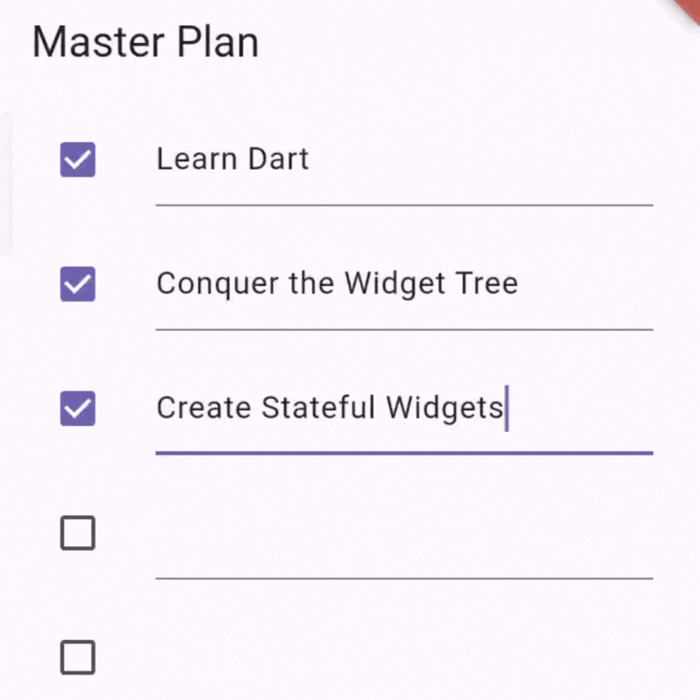
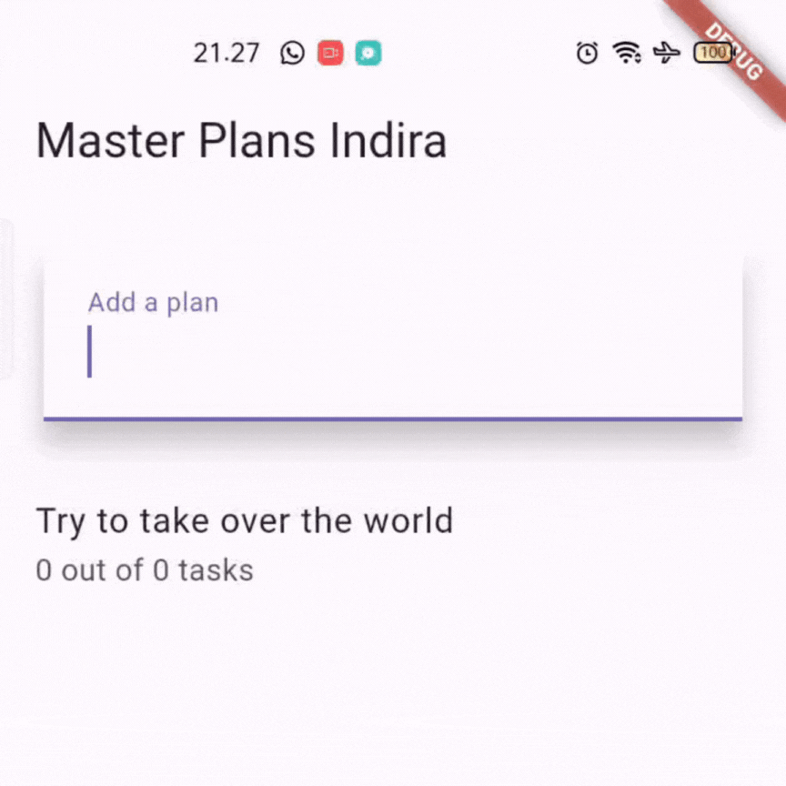

# Laporan Jobsheet 10 - State: Model-View, InheritedWidget, Multiple Screens

**Nama:** Indira Nafa Aurah Huda  
**NIM:** 2341720001  
**Kelas:** TI-3E

## Tujuan
Memahami dasar state dengan pemisahan model-view, menerapkan `InheritedWidget`/`InheritedNotifier` untuk pengelolaan data, dan mengangkat state ke beberapa screen (multi-screen state).

---

## Praktikum 1: Dasar State dengan Model-View

### Tujuan
Membuat aplikasi Master Plan sederhana yang menyimpan model `Plan` dan `Task` di lapisan data, lalu menghubungkannya ke view dengan pola immutable state update.

### Ringkasan Implementasi
- Membuat model di `models/task.dart` dan `models/plan.dart`.
- Mengeksport kumpulan model lewat `models/data_layer.dart`.
- `main.dart` memanggil `PlanScreen` sebagai home dan set tema.
- `PlanScreen` berupa `StatefulWidget` yang menampilkan daftar tugas (`ListView`) dan tombol tambah (`FloatingActionButton`).
- Pada setiap perubahan (tambah tugas, ubah teks, ceklis), state di-update dengan membuat instance `Plan` baru (immutable update).
- Menambahkan `ScrollController` agar saat scrolling semua `TextField` kehilangan fokus (menghindari keyboard menutupi input di iOS) dan menambahkan `dispose()` untuk membersihkan controller.

### GIF Hasil
Praktikum 1 — lihat GIF berikut:  

### Penjelasan poin penting
- Langkah 4 (membuat `data_layer.dart`) dimaksudkan untuk menyederhanakan impor model. Dengan mengekspor `plan.dart` dan `task.dart` dari satu file, file view hanya perlu mengimpor satu path (`models/data_layer.dart`) sehingga mengurangi banyak impor seiring bertambahnya model.
- Variabel `plan` pada `PlanScreen` menyimpan state tampilan lokal yang merepresentasikan daftar tugas saat ini. Mengapa `const Plan()` (konstanta) pada inisialisasi? Menggunakan konstanta memudahkan pembuatan instance immutabe default yang dapat dibandingkan oleh Dart secara efisien dan menghindari null-safety complexity. Selain itu, pattern immutability (membuat instance baru setiap perubahan) membuat alur data lebih mudah diprediksi.

### Capture Langkah 9 (GIF dan penjelasan)
- GIF `JB10_1` menampilkan proses: menambah tugas baru, mengetik deskripsi tugas, dan menandai tugas selesai. Implementasi yang dibuat: setiap kali teks berubah atau checkbox dipilih, dibuat `Plan` baru dengan daftar `tasks` yang juga direplikasi menggunakan `List<Task>.from(...)` dan mengganti elemen pada index tertentu. Ini menjaga immutability model.

### Fungsi method pada Langkah 11 dan 13 (lifecycle)
- `initState()` (Langkah 11): dipanggil sekali saat `State` di-mount. Di sini kita menginisialisasi `ScrollController` dan menambahkan listener untuk menghilangkan fokus input ketika scroll terjadi. Penting karena `initState` adalah tempat yang tepat untuk membuat resource yang bergantung pada konteks widget.
- `dispose()` (Langkah 13): dipanggil saat `State` di-unmount; digunakan untuk melepaskan resource seperti `ScrollController` dan `TextEditingController` agar tidak terjadi memory leak.

---

## Praktikum 2: Mengelola Data Layer dengan InheritedWidget dan InheritedNotifier

### Tujuan
Memindahkan state aplikasi (model `Plan`) keluar dari widget view ke sebuah provider berbasis `InheritedNotifier` sehingga view dapat membaca dan bereaksi terhadap perubahan tanpa menyimpan state lokal secara berlebihan.

### Ringkasan Implementasi
- Membuat `provider/plan_provider.dart` yang mendefinisikan `PlanProvider extends InheritedNotifier<ValueNotifier<Plan>>`.
- Mengubah `main.dart` agar membungkus `PlanScreen` dengan `PlanProvider(notifier: ValueNotifier<Plan>(const Plan()), child: PlanScreen())`.
- Mengganti operasi update state di `PlanScreen` dengan membaca dan menulis ke `ValueNotifier<Plan>` dari `PlanProvider.of(context)`.
- Menggunakan `ValueListenableBuilder<Plan>` untuk rebuild area UI yang membutuhkan data ketika `notifier.value` berubah.

### Apa itu InheritedWidget pada Langkah 1? Mengapa InheritedNotifier?
- `InheritedWidget` adalah mekanisme Flutter untuk menyampaikan data turun (down the widget tree) ke widget anak tanpa perlu meneruskan eksplisit lewat constructor. Widget turun dapat memanggil `context.dependOnInheritedWidgetOfExactType` untuk mendapatkan referensi dan juga menerima rebuild otomatis saat `InheritedWidget` berubah (jika dependensi dibuat).
- `InheritedNotifier<T extends Listenable>` adalah varian yang menghubungkan `InheritedWidget` dengan sebuah `Listenable` (mis. `ValueNotifier`). `InheritedNotifier` membuatnya mudah untuk menggabungkan kemampuan broadcast-notify (`ValueNotifier`) dengan mekanisme inheritance sehingga child-widget bisa mendapat update otomatis saat `notifier` berubah. Karena kita menggunakan `ValueNotifier<Plan>` sebagai sumber perubahan yang sederhana, `InheritedNotifier` adalah opsi pas dan ringkas.

### Maksud method pada Langkah 3 (model `Plan`)
- Menambahkan getter `completedCount` menghitung jumlah `Task` yang `complete == true`.
- Menambahkan getter `completenessMessage` merangkai pesan ringkasan seperti "2 out of 5 tasks".
- Tujuan: memindahkan logic-presentasi atau helper dari view ke model sehingga view menjadi lebih kecil dan fokus ke rendering. Ini juga memudahkan penggunaan kembali logic tersebut di banyak tempat.

---

## Praktikum 3: Membuat State di Multiple Screens

### Tujuan
Membangun fitur multiple plans (master plans) sehingga pengguna dapat membuat beberapa kelompok plan dan berpindah antar screen sambil menjaga state tetap konsisten.

### Ringkasan Implementasi
- Mengubah `PlanProvider` agar membawa `ValueNotifier<List<Plan>>` (list of plans) sehingga provider bisa menyimpan beberapa `Plan` sekaligus.
- Membuat `PlanCreatorScreen` untuk menambah plan baru (menggunakan `TextEditingController`) dan menampilkan daftar master plans.
- Mengubah `PlanScreen` (detail per-plan) menjadi menerima `Plan plan` sebagai parameter konstruktor. Di dalam `PlanScreen` kita baca `plansNotifier` dari `PlanProvider` dan pilih `currentPlan` berdasarkan `name` (atau identitas lain).
- Saat melakukan update pada sebuah plan, kita update list plans di `plansNotifier.value` dengan membuat salinan list dan mengganti elemen pada index plan tersebut.

### Penjelasan diagram (lift state up / navigation)
Gambar diagram (dalam soal) menggambarkan alur dari sebuah `MaterialApp` yang menaruh `PlanProvider` di atas sehingga state (model) tersedia untuk banyak screens. Ketika berpindah ke `PlanCreatorScreen` lalu menavigasi ke `PlanScreen`, state tetap berada di atas (tidak di-recreate) sehingga semua screen dapat mengakses dan memodifikasi shared state. Dengan kata lain, "lift state up" berarti menempatkan state pada ancestor bersama (shared parent) sehingga child-widget di beberapa route/screen dapat mendapatkannya.

### GIF Hasil Praktikum 3
Praktikum 3 — lihat GIF berikut:  

---

## Kesimpulan & Catatan
- Pada Praktikum 1 kita mempelajari pola model-view dan penggunaan immutability untuk mengelola state sederhana.
- Pada Praktikum 2 kita memisahkan model ke provider berbasis `InheritedNotifier` sehingga view menjadi lebih bersih dan perubahan state didistribusikan dengan baik.
- Pada Praktikum 3 kita mengangkat state ke tingkat yang lebih tinggi (list of plans) sehingga banyak screen bisa berbagi state yang sama.

---

