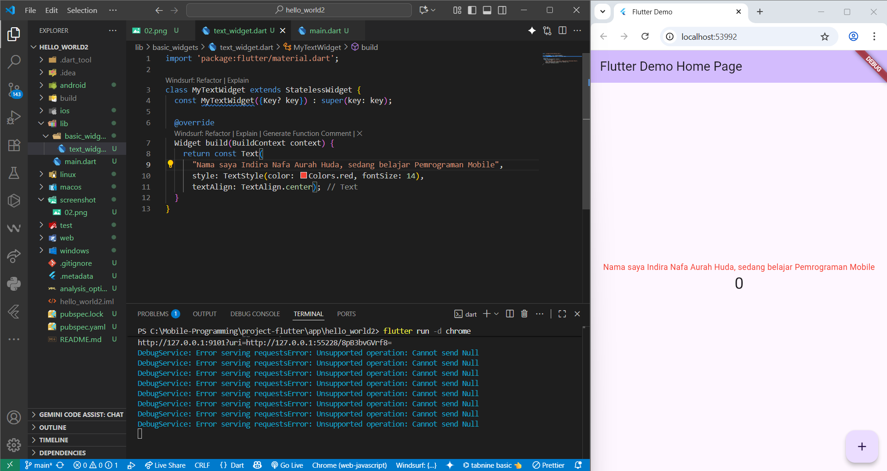
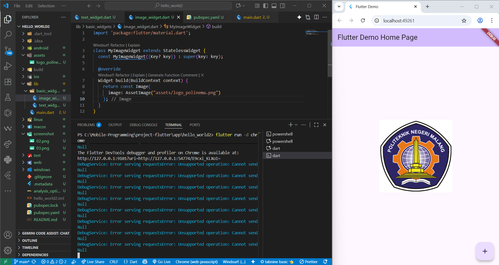
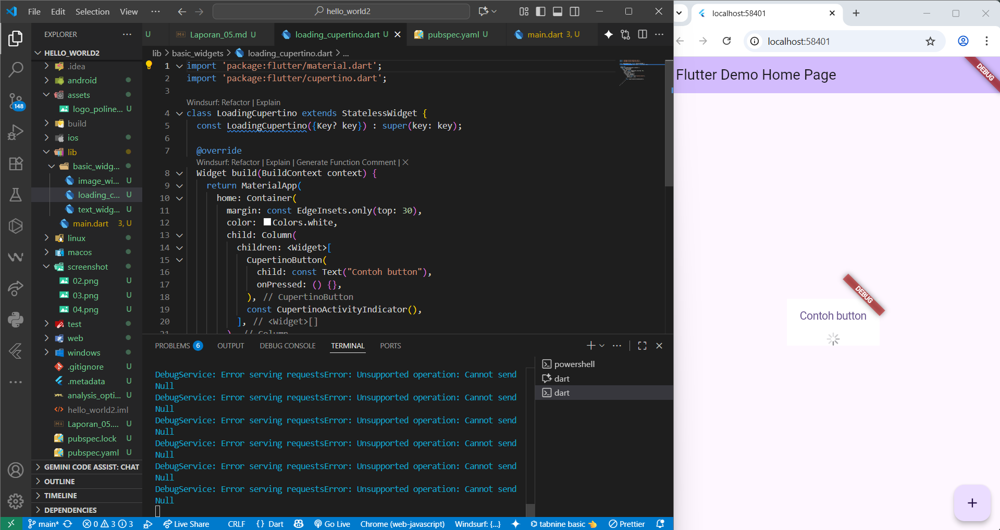
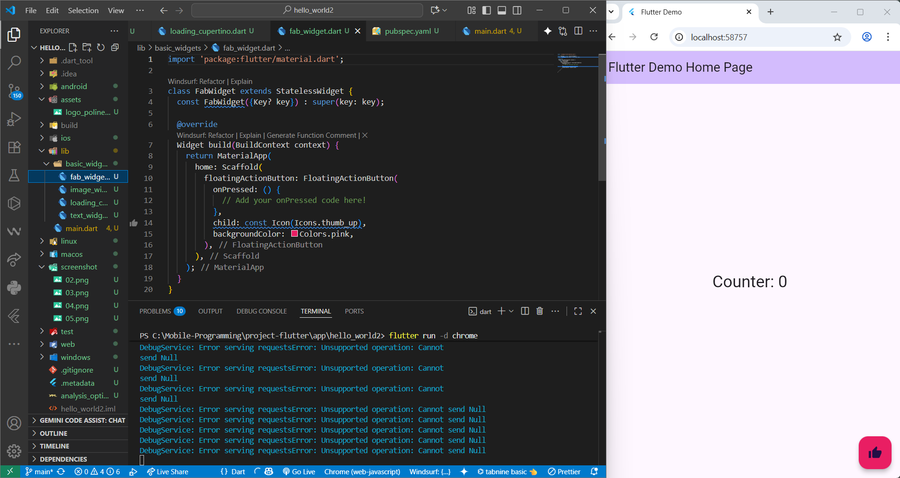
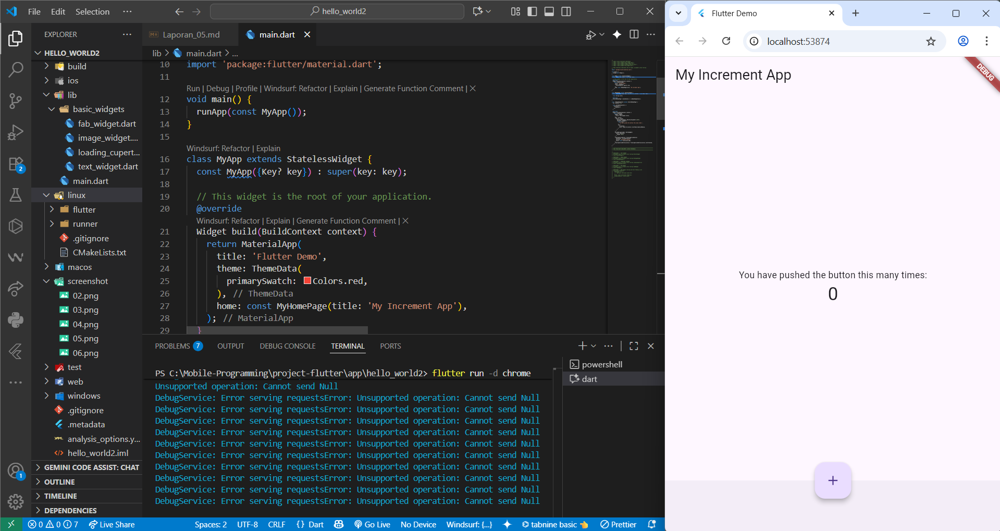
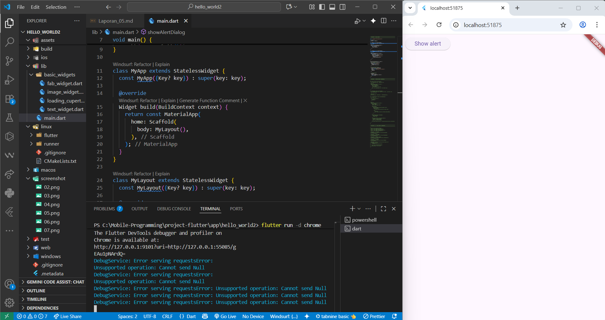
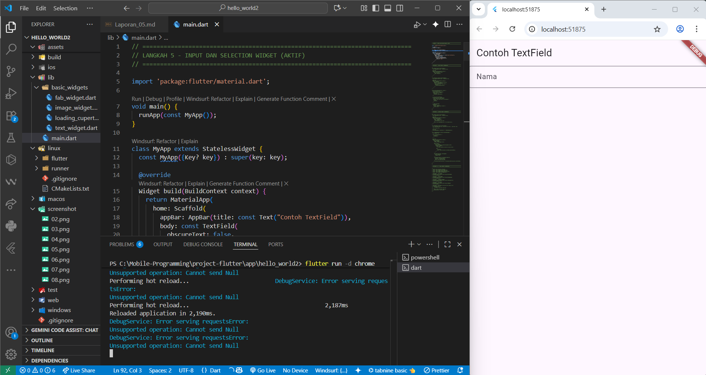
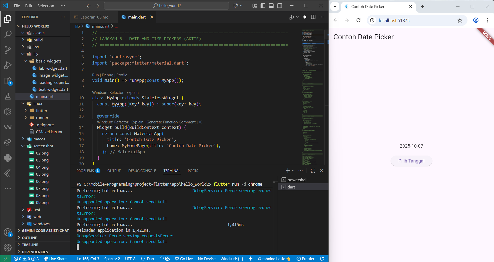

# Laporan Jobsheet 5 - Basic Widget Flutter

**Nama**: Indira Nafa Aurah Huda  
**NIM**: 2341720001
**Kelas**: TI 3E

## Praktikum 4: Menerapkan Widget Dasar

### Langkah 1: Text Widget

#### Tujuan
Membuat widget text sederhana untuk menampilkan teks dengan styling tertentu.

#### Langkah-langkah Implementasi

1. **Membuat folder `basic_widgets`**
   - Buat folder baru bernama `basic_widgets` di dalam folder `lib/`
   - Folder ini akan berisi berbagai widget dasar yang akan dibuat

2. **Membuat file `text_widget.dart`**
   - Buat file baru `text_widget.dart` di dalam folder `lib/basic_widgets/`
   - File ini berisi implementasi widget text custom

3. **Implementasi kode `MyTextWidget`**
   ```dart
   import 'package:flutter/material.dart';

   class MyTextWidget extends StatelessWidget {
     const MyTextWidget({Key? key}) : super(key: key);

     @override
     Widget build(BuildContext context) {
       return const Text(
         "Nama saya Indira Nafa Aurah Huda, sedang belajar Pemrograman Mobile",
         style: TextStyle(color: Colors.red, fontSize: 14),
         textAlign: TextAlign.center);
     }
   }
   ```

4. **Modifikasi `main.dart`**
   - Import file `text_widget.dart`
   - Ganti widget body dengan `MyTextWidget()`

#### Penjelasan Kode

- **StatelessWidget**: Widget yang tidak memiliki state yang berubah-ubah
- **TextStyle**: Untuk mengatur styling text seperti warna dan ukuran font
- **TextAlign.center**: Untuk mengatur alignment text ke tengah
- **Colors.red**: Menggunakan warna merah dari material design

#### Screenshot


### Langkah 2: Image Widget

#### Tujuan
Membuat widget untuk menampilkan gambar dari assets project.

#### Penjelasan Kode

- **AssetImage**: Untuk memuat gambar dari folder assets
- **pubspec.yaml**: File konfigurasi untuk mendefinisikan assets yang digunakan
- **assets/**: Konvensi penamaan folder untuk menyimpan file assets
- **Image widget**: Widget bawaan Flutter untuk menampilkan gambar

#### Screenshot


## Praktikum 5: Menerapkan Widget Material Design dan iOS Cupertino

### Langkah 1: Cupertino Button dan Loading Bar

#### Tujuan
Membuat widget menggunakan Cupertino design (iOS style) yang terdiri dari button dan loading indicator.

#### Langkah-langkah Implementasi

1. **Membuat file `loading_cupertino.dart`**
   - Buat file baru di folder `lib/basic_widgets/`
   - Import material dan cupertino packages

#### Penjelasan Kode

- **CupertinoButton**: Button dengan style iOS/Cupertino design
- **CupertinoActivityIndicator**: Loading indicator dengan style iOS
- **Container**: Wrapper dengan styling (margin, color)
- **Column**: Layout widget untuk menyusun children secara vertikal
- **EdgeInsets.only(top: 30)**: Memberikan margin atas 30 pixel

#### Screenshot


### Langkah 2: Floating Action Button (FAB)

#### Tujuan
Membuat Floating Action Button dengan styling custom menggunakan material design.

#### Penjelasan Kode

- **FloatingActionButton**: Button melayang dengan shape circular
- **Icons.thumb_up**: Icon jempol dari material design icons
- **backgroundColor: Colors.pink**: Mengatur warna background menjadi pink
- **onPressed**: Callback function yang dipanggil saat button ditekan

#### Screenshot


### Langkah 3: Scaffold Widget

#### Tujuan
Menggunakan Scaffold widget untuk mengatur tata letak sesuai dengan material design.

#### Penjelasan Kode

- **Scaffold**: Struktur dasar layout material design
- **AppBar**: Header bar di bagian atas
- **BottomAppBar**: Navigation bar di bagian bawah
- **FloatingActionButtonLocation.centerDocked**: Posisi FAB di tengah bawah
- **StatefulWidget**: Widget yang memiliki state yang dapat berubah
- **setState()**: Method untuk memperbarui state dan UI

#### Screenshot


### Langkah 4: Dialog Widget

#### Tujuan
Mengimplementasikan AlertDialog untuk menampilkan popup dialog.

#### Penjelasan Kode

- **AlertDialog**: Widget untuk menampilkan dialog box
- **showDialog()**: Method untuk menampilkan dialog
- **Navigator.pop()**: Method untuk menutup dialog
- **TextButton**: Button dengan style text
- **ElevatedButton**: Button dengan efek elevation/shadow

#### Screenshot


### Langkah 5: Input dan Selection Widget

#### Tujuan
Mengimplementasikan TextField untuk menerima input dari user.

#### Penjelasan Kode

- **TextField**: Widget untuk input text dari user
- **InputDecoration**: Dekorasi untuk styling TextField
- **OutlineInputBorder**: Border dengan outline style
- **labelText**: Text label yang muncul di dalam TextField
- **obscureText: false**: Menentukan apakah text disembunyikan (untuk password)

#### Screenshot


### Langkah 6: Date and Time Pickers

#### Tujuan
Mengimplementasikan Date Picker untuk memilih tanggal.

#### Penjelasan Kode

- **showDatePicker()**: Method untuk menampilkan date picker dialog
- **DateTime**: Class untuk merepresentasikan tanggal dan waktu
- **Future<void>**: Return type untuk async function
- **async/await**: Pattern untuk handling asynchronous operation
- **setState()**: Method untuk memperbarui state setelah tanggal dipilih
- **SizedBox**: Widget untuk memberikan spacing

#### Screenshot


## Kesimpulan

1. **Cupertino Widgets** memberikan tampilan iOS-style dalam aplikasi Flutter
2. **FloatingActionButton** merupakan komponen penting dalam Material Design
3. **Scaffold** menyediakan struktur layout yang konsisten
4. **Dialog Widget** berguna untuk interaksi user yang membutuhkan konfirmasi
5. **TextField** adalah komponen dasar untuk input data dari user
6. **Date Picker** memudahkan user dalam memilih tanggal dengan interface yang user-friendly

