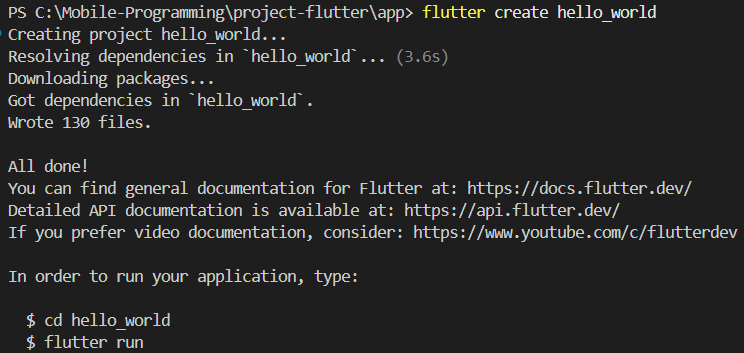
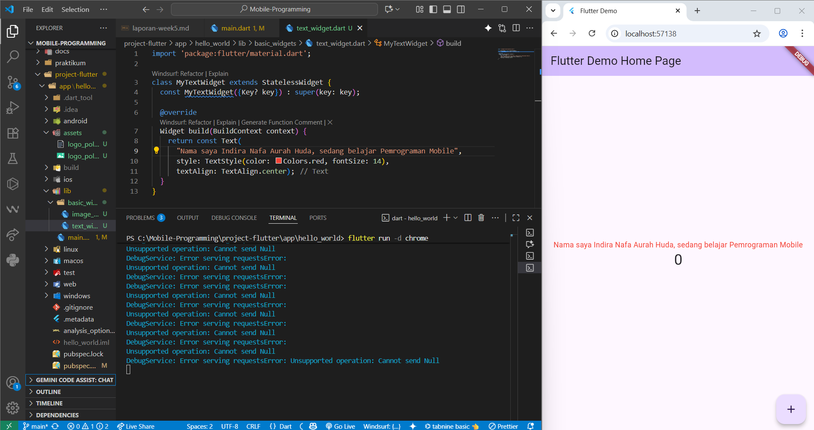
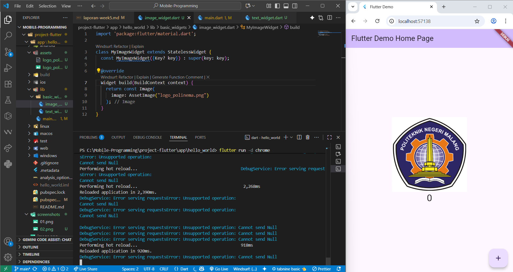
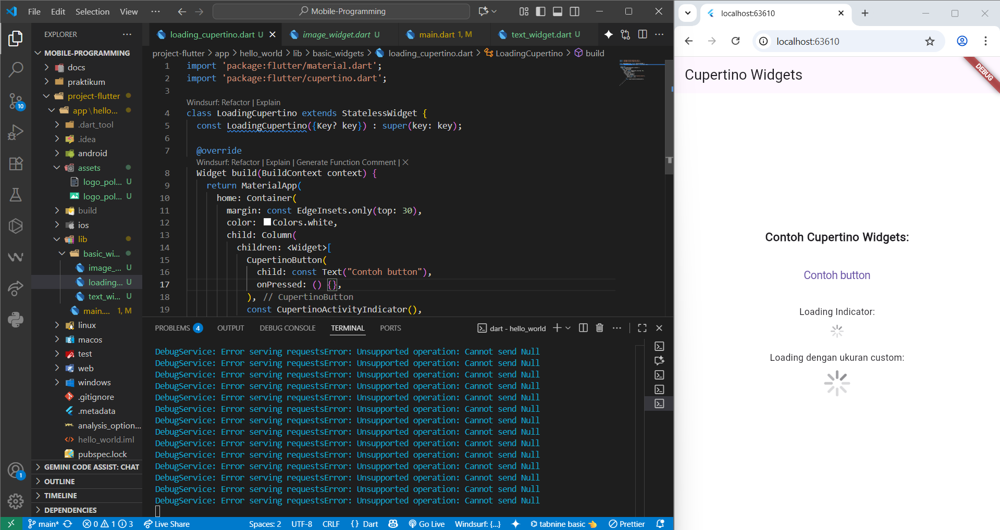
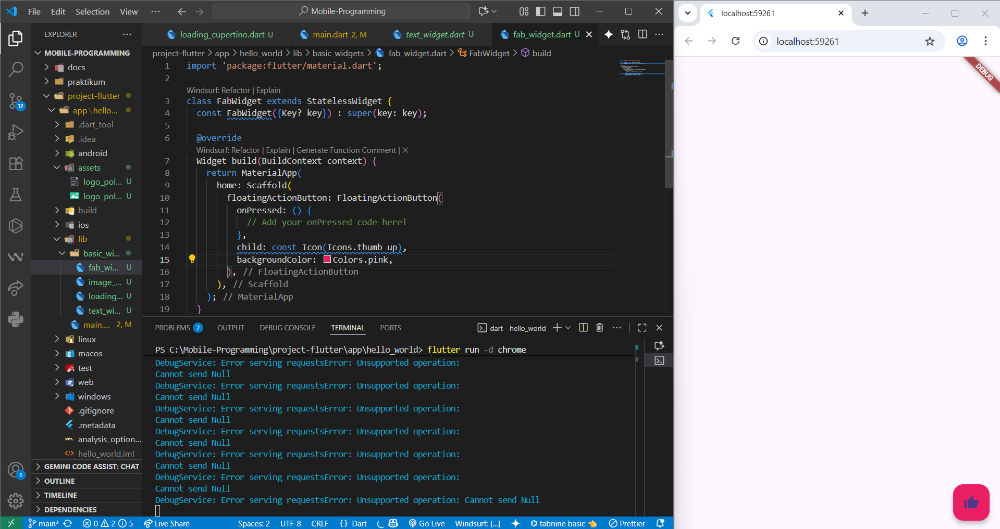
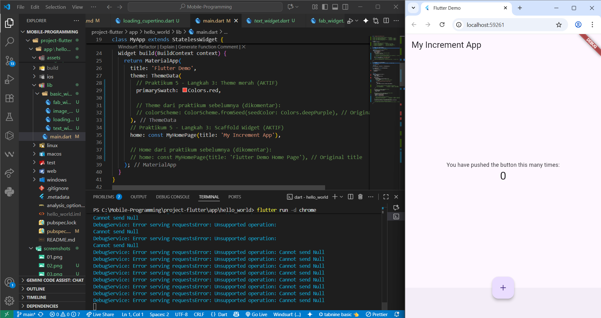
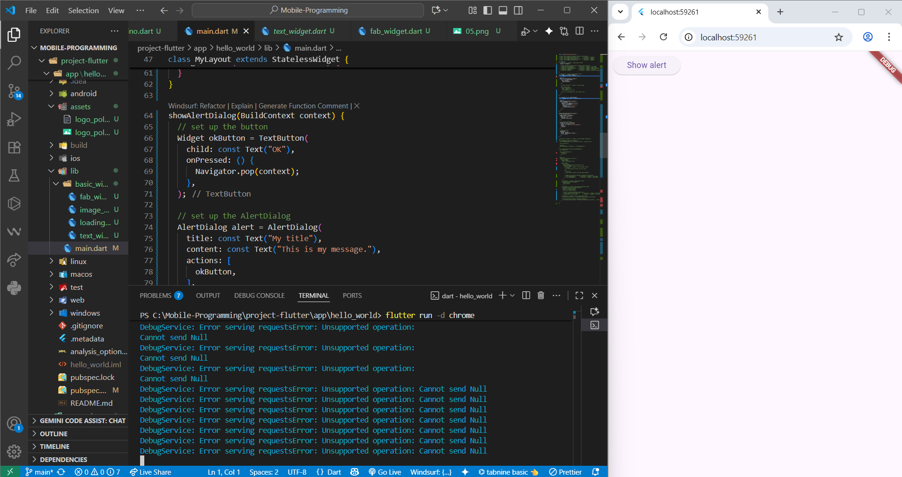
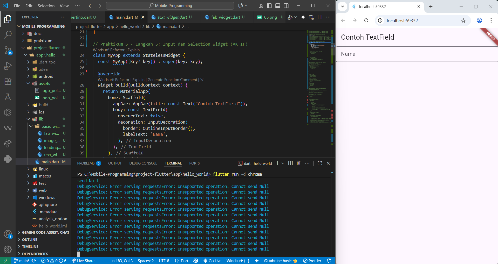

# Project Flutter - Mobile Programming

## Praktikum 1: Membuat Project Flutter Baru

### Tujuan
Membuat project Flutter baru dengan nama `hello_world` dan memahami struktur dasar project Flutter.

### Langkah-langkah

#### Langkah 1: Membuka Command Palette
- Buka VS Code
- Tekan `Ctrl + Shift + P` untuk membuka Command Palette
- Ketik "Flutter" dan pilih "New Application Project"

#### Langkah 2: Memilih Lokasi Project
- Pilih folder `project-flutter/app` sebagai lokasi project
- Klik "Select a folder to create the project in"

#### Langkah 3: Membuat Nama Project
- Buat nama project: `hello_world`
- Pastikan menggunakan huruf kecil semua (lowercase)
- Gunakan underscore (_) untuk memisahkan kata
- Tekan Enter dan tunggu proses selesai

#### Langkah 4: Verifikasi Project
- Pastikan project berhasil dibuat dengan pesan "Your Flutter Project is ready!"
- Struktur project Flutter standar sudah terbentuk

### Hasil

## Praktikum 4: Membuat Project Flutter Baru

#### Langkah 1: Text Widget
### Hasil

#### Langkah 2: Image Widget
### Hasil

## Praktikum 5: Menerapkan Widget Material Design dan iOS Cupertino

#### Langkah 1: Cupertino Button dan Loading Bar
### Hasil

#### Langkah 2: Floating Action Button (FAB)
### Hasil

#### Langkah 3: Scaffold Widget
### Hasil

#### Langkah 4: Dialog Widget
### Hasil

#### Langkah 5: Input dan Selection Widget
### Hasil
